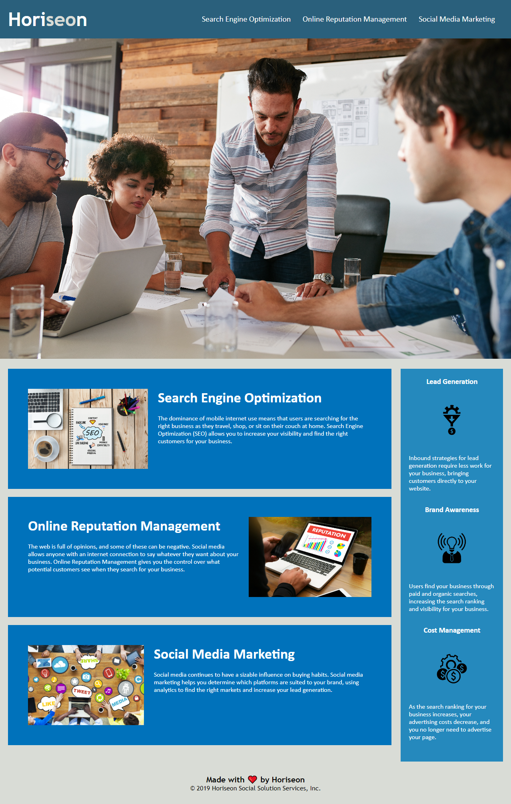

# Horiseon Solutions

## Description

Horiseon solutions is a Marketing agency. This website is the platform through which they promote their services. It contains links to the different services they provide with descriptions. The website ensures that best practices for accesibility and Search Engine Optimization are followed through the use of Semantic HTML and accesible image elements.This helps businesses have an easier time accessing Horiseon's digital services.

## Table of Contents

* [Installation](#installation)
* [Usage](#usage)
* [Credits](#credits)
* [License](#license)
* [Badges](#badges)

## Installation

N/A

## Usage 

Go To: [codrincarpovici.github.io/horiseonsolutions/](https://codrincarpovici.github.io/horiseonsolutions/) and view the website. 

On the website you can click the different navigation links in the navbar to get to the respective sctions.
You can also read about the Horiseon services provided and their descriptions.
Screen Readers can also follow the semantic structure of the page.

## Credits

N/A

## License

## Badges

